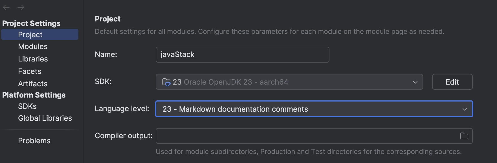
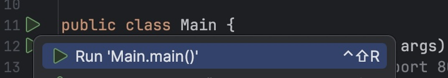

## Run the project

### Command line

```./gradlew run```

### Intellij

Ensure that you have the project set to Java 23 (or newer)




### API

Flex "hello world" based on language using Dependency injection for language selection.

``` curl -u admin:password localhost:8080/hello```
``` curl -u admin:password -H "Accept-Language: es" localhost:8080/hello```
